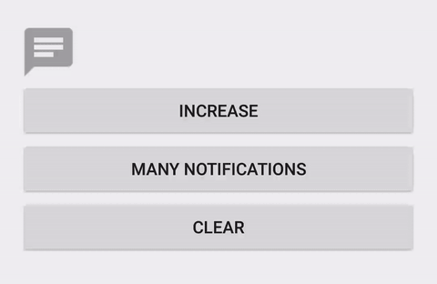

# NotificationBadge

A notification badge with animation.




## Gradle

```
implementation 'com.nex3z:notification-badge:1.0.0'
```


## Usage

Use `setNumber(int number)` or `setText(String text)` to add number or arbitrary text on the badge. Use `clear()` to clear the badge.


## Attributes

| Attribute           | Format    | Description                                                                                                |
|---------------------|-----------|------------------------------------------------------------------------------------------------------------|
| textSize            | dimension | Text size.                                                                                                 |
| textColor           | color     | Text color.                                                                                                |
| nbBackground        | reference | Badge background image.                                                                                    |
| nbAnimationEnabled  | boolean   | `true` to enable animation, `false`to disable it. The default is `true`.                                   |
| nbAnimationDuration | integer   | Duration of the animation in milliseconds. The default is `500` milliseconds.                              |
| nbMaxTextLength     | integer   | Max text length allowed to show on the badge. The default is `2`.                                          |
| nbEllipsizeText     | string    | Special text to show when the length of the original text reaches `nbMaxTextLength`. The default is `...`. |

## Licence

```
Copyright 2016 nex3z

Licensed under the Apache License, Version 2.0 (the "License");
you may not use this file except in compliance with the License.
You may obtain a copy of the License at

   http://www.apache.org/licenses/LICENSE-2.0

Unless required by applicable law or agreed to in writing, software
distributed under the License is distributed on an "AS IS" BASIS,
WITHOUT WARRANTIES OR CONDITIONS OF ANY KIND, either express or implied.
See the License for the specific language governing permissions and
limitations under the License.
```
